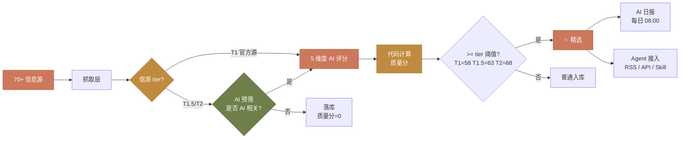
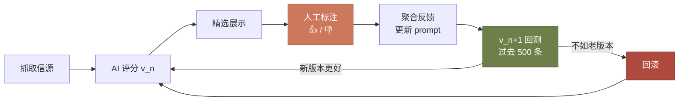
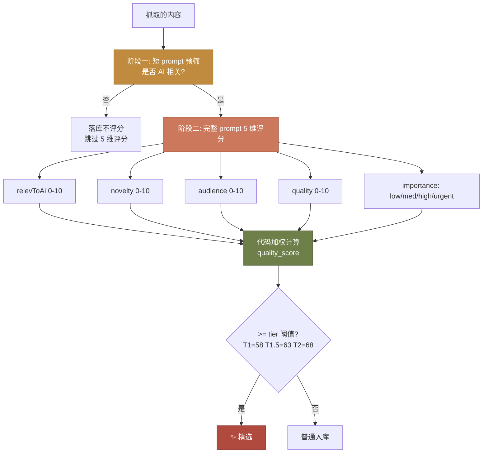
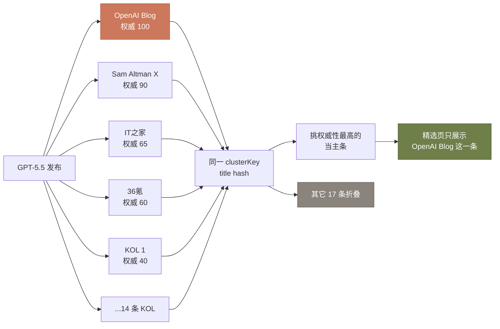

## 🎯 写在前面

每天打开手机，AI 圈又出了一堆新东西。OpenAI 又发模型了？Anthropic 又更新了？Cursor 又上新功能了？还是 Karpathy 转了篇论文？

我每天大概要花 1 小时去刷 X、订 RSS、扫公众号、看 IT 之家——为的就是不错过任何一条值得关注的 AI 资讯。

可慢慢的我发现，我刷信息的时间，已经比我消化信息的时间还长了。😮‍💨

> **这个时代不缺信息，缺的是「值得读的信息」。**

于是我花了一个多月的业余时间，造了一个开源的工具——**AI Hot Radar**。

🌐 在线体验：[aihotradar.com](https://aihotradar.com)
🔗 仓库地址：[github.com/zenitlab/ai-hot-radar](https://github.com/zenitlab/ai-hot-radar)

它做的事情很简单，一句话能说清楚：

> 持续从全网抓取 AI 资讯，用 AI 自己评分筛掉噪音，把真正值得读的内容沉淀到「精选」「AI 日报」「热点雷达」三个视图里。


## 🏗️ 整体架构

先上一张总览图，让你大概知道这个东西是怎么转起来的：



技术栈很常规，没啥新东西：

- **后端**：NestJS 11 + Prisma + SQLite + Socket.io
- **前端**：React 19 + Vite + TailwindCSS + lucide-react
- **AI**：兼容 OpenAI 协议（百炼 / 硅基流动 / DeepSeek / 小米 MiMo 等）

之所以选 NestJS 是因为它自带的 `@Cron` 装饰器和模块化结构，写定时任务和拆服务都干净。SQLite 单文件部署，省心。

> ⏰ **抓取节奏**：热点雷达每 **10 分钟** 自动跑一轮——遍历所有 RSS / 搜索 / X 信源，新内容立刻送进 AI 预筛和 5 维评分管线。也就是说从 OpenAI 官博发文，到内容出现在你的精选页，最长不会超过 10 分钟。Cron 表达式：`@Cron('0 */10 * * * *')`。

## 📡 信源精选：宁缺毋滥

很多人做爬虫第一反应就是「越多越好」，能爬就爬。我恰恰相反——**信源比信息重要**。

我目前在持续监控 **70+ 信息源**（包括 RSS、搜索引擎、X 等渠道），分成 4 类：

| 类型            | 代表                                                                                          | tier      | 抓取方式      |
| --------------- | --------------------------------------------------------------------------------------------- | --------- | ------------- |
| 🏢 国际官方博客 | OpenAI / Anthropic / DeepMind / NVIDIA / Meta AI                                              | T1        | RSS           |
| 📚 学术         | arXiv (cs.AI/CL/LG/CV) / HuggingFace Daily Papers                                             | T1        | RSS           |
| 🐦 社交 / KOL   | 17 个 AI 头部 KOL X 账号 + 国内大模型官方号（DeepSeek / Kimi / 智谱 / 阶跃 / 通义 / MiniMax） | T1.5 / T2 | twitterapi.io |
| 📰 中文媒体     | IT 之家 / 36 氪 / 财联社 / 雪球 / InfoQ                                                       | T1.5 / T2 | RSS           |

> ⚠️ **关于 X 这块的小心酸**：X 上 AI 圈的信息密度和时效性都是顶级的，OpenAI 员工放风、模型权重在 HF 仓库提前出现、Karpathy 顺手发个观察都能在 X 第一时间看到，比官方公告早几小时是常态。
>
> 但 X 官方 API 走不通（个人账号 $100/月起），我用的 [twitterapi.io](https://twitterapi.io) 第三方代理，免费额度只有 **10000 次调用**，加上 17 个 KOL + 关键词搜索一天就能跑完。😭 后续要继续用就得充值，奈何**囊中羞涩**——所以 X 这块大概率会跑着跑着断粮，断了就只能从 RSS / Bing / HackerNews 这些不要钱的渠道凑合。
>
> 如果你 fork 项目自己跑，我建议把 `TWITTER_API_KEY` 留空也没关系——其它源足够覆盖 80% 以上的关键资讯。X 是锦上添花，不是雪中送炭。

tier 是后续评分的重要权重，秉持「**一手信息优先**」的原则：

```typescript
export const TIER_MULTIPLIER: Record<SourceTier, number> = {
  T1: 1.3, // OpenAI Blog 这种官方一手
  "T1.5": 1.1, // 头部 KOL / 知名媒体
  T2: 1.0, // 普通信源
};
```

OpenAI 官博发的东西，自然比 V2EX 上的转发更权威——同样一条新闻，分数会差出 30% 以上，直接影响是否能进精选。

## 🤖 双阶段 AI 评分：踩了 10+ 版的坑

这是整个系统**最难**的部分，也是我**烧钱最多**的部分。

> 调试过程中光是给 AI 评分喂数据、改 prompt、回测验证，光 token 就烧了 **1000+ credits**。😭

### 第一版：朴素的「让 AI 一把梭」

刚开始我觉得这事不就一个 prompt 的事吗？

```
你是 AI 资讯质量评估专家，给定一条内容，返回 0-100 的质量分，
高于 70 的算精选。
```

跑了一周，结果**一塌糊涂**：

- 一些硬核论文动不动 90 分，我点开三秒就关了
- Sam Altman 转一条鸡汤推文，模型给 87 分
- 同一件事被 OpenAI 官博、X、IT 之家、36 氪报道了 7 遍，**7 遍全部进精选** 🤡

我开始往 prompt 里加规则：

> 「大佬转发要降分」「同一事件已被报道过要降分」「营销软文降到 50 以下」「国内大公司发模型不要因为不是英文环境就低估」……

加着加着，prompt 长到 600 行。📜

### 第二版：人类反馈 + 自动评估

4 月份我做了件当时自认为是里程碑的事——**人类反馈标注**：



听起来很酷对吧？模型 + 人类反馈 + 自动评估 + 持续迭代。这不就是标准的 AI 产品做法嘛。

跑了一周，**我崩溃了**。😵

规则越加越多，模型的泛化能力越差，反而越来越「死板」。我又加了双维度评分、实体热度感知（让模型知道哪个公司最近很火）……

**v7 → v8 的迭代是纯粹的负向优化。** 我直接全面回滚。

### 第三版：能用代码就别用 AI

那一刻，我才想起来一句话——**能用脚本就别用 Agent**。

最大的错误是，我把所有事都交给了模型：打分是它、权重计算是它、打标是它、判断是否精选还是它。模型只擅长**做模糊判断**，不擅长**做精确加权**。

于是我推倒重构。新方案是把模型和代码的职责彻底拆开：



**职责切分清楚后，神奇的事情发生了：**

- prompt 从 **600 行 → 200 行**，模型出错率断崖式下降
- 调权重不再需要重跑大模型——改个数字几秒搞定
- 整体 AI 调用次数下降 **~50%**（预筛短 prompt 挡掉大量非 AI 内容，跳过昂贵的 5 维评分）

> 📝 **关于模型选择**：当前项目里预筛和 5 维评分用的是**同一个模型**（兼容 OpenAI 协议的任意服务，比如 DeepSeek / Qwen / 小米 MiMo 等）。把预筛拆给更便宜的模型（比如 DeepSeek V3.2 这种 ~0.5 元/M token 量级），把 5 维评分留给更强的模型（Qwen-Plus / DeepSeek-Chat），是下一步要做的成本优化——理论上能在现有基础上再砍掉一半左右的 token 开销。

最终的质量分公式大概长这样（简化版）：

```typescript
qualityScore =
  (relevToAi * 0.25 + novelty * 0.3 + audience * 0.25 + quality * 0.2) *
    10 *
    TIER_MULTIPLIER[tier] * // 信源加成
    importanceMultiplier + // urgent=1.2, high=1.1, medium=1.0, low=0.85
  boostSignals; // SOTA / 顶级实验室署名 等加分项
```

整套机制本质上模拟的就是我自己作为内容创作者，每天刷信息时脑子里那套**隐性的过滤机制**——只是把它显式地写成了代码。

## 🔗 事件聚类：同一件事只看一遍

GPT-5.5 发布的时候，我抓到了 **18 条**相关报道：OpenAI 官方博客 1 条，Sam Altman 推特 1 条，IT 之家 1 条，36 氪 1 条，KOL 转发 14 条……

如果 18 条全部展示，精选页就废了。



实现就是给每条内容算一个 `clusterKey`（标题前 30 字符的 md5 截断），同一个 cluster 内按权威性挑主条：

> **OpenAI 官博 > 官方推特 > 大型媒体 > KOL 转发 > 营销号**

新条目进来如果 cluster 里已经有主条，并且新主条权威性更高，就**自动接管**主条位置，老主条降级折叠——这样保证了精选页永远展示**最权威的来源**。

## 📰 AI 日报：每天早上 8 点

每天北京时间 **08:00**，系统自动生成前一天的 AI 行业日报：

- 🔥 今日重点（最值得看的 3-5 条 + 「为什么重要」+ 影响范围）
- 🤖 模型情报（发布 / 更新 / 降价）
- 🌍 国内动态 / 🌎 国外动态
- 🧩 AI 产品动态
- 👥 社区热议
- 📄 论文 & 技术趋势

> 之所以放在早上 8 点而不是 0 点，是因为：(1) 给 AI 评分一整夜的处理时间，(2) 8 点正好是大家通勤、刷手机的时间。

## 🤖 Agent 接入：让 AI 助手也能用

光自己用还不够，我把整个系统封装成了三种**外部接入方式**：

| 方式        | 用法                                                                           | 适合场景                        |
| ----------- | ------------------------------------------------------------------------------ | ------------------------------- |
| 🪄 Skill    | Claude Code / Cursor 安装后，AI 助手自动获得"查日报、查精选、按关键词搜索"能力 | AI 编程工具                     |
| 📡 RSS      | 3 个 Feed（精选 / 全量 / 日报）                                                | Feedly / Inoreader              |
| 🔌 REST API | 5 个无认证 JSON 接口                                                           | 飞书机器人 / n8n / 自动化工作流 |

```bash
# 比如直接 curl 拿今日精选
curl https://your-domain/api/agent/rss/curated.xml

# 或者按关键词搜索
curl "https://your-domain/api/agent/search?q=Claude&limit=5"
```

我自己最常用的就是飞书机器人——把 RSS feed 注册到飞书的 RSS 订阅，每条新精选自动推送到群里。

## 🎨 浅色模式：参照 Anthropic 官网

我对默认的"白底黑字"浅色模式过敏——太刺眼，长时间看眼睛累。所以参照了 [anthropic.com](https://anthropic.com) 的暖色调风格：

- 🟫 暖米色画布 `#efece4`（不是冷白）
- 🟧 珊瑚橙主色 `#cc785c`
- 🍊 卡片用 `#fdfbf3` 微黄白，跟画布有清晰层级
- 📖 H1 标题用 **Fraunces** 衬线体，编辑感更强

加上深色模式的二次校准（Linear/Notion 风格的中性炭灰），日夜切换都很舒服。

## 🛠️ 几个踩过的坑

### 坑 1：MiMo 这种推理模型解析不了

刚换小米 MiMo（v2.5-pro）的时候，几乎 **100% parse failure**：

```
AI analysis failed: Error: Failed to parse AI response
```

排查发现是 MiMo 是推理模型，会先输出一段 `<think>...</think>` 思考块再输出 JSON。代码里的贪婪正则 `/\{[\s\S]*\}/` 会把 `<think>` 里的中文花括号也匹进来，直接把 JSON.parse 干挂。

更糟的是 `max_tokens: 500` 在 `<think>` 阶段就烧光了，根本输出不到 JSON。

修复就是：

1. 解析前先剥掉 `<think>...</think>` 块（包括未闭合的，因为可能被截断）
2. `max_tokens` 调到 1500-2500（推理模型必须）
3. timeout 30s → 60s

### 坑 2：429 速率限制

MiMo 的 RPM 限制比百炼/SiliconFlow 严格得多，并发 15 个请求秒爆 429。

解决方案是加全局**信号量限流** + **指数退避重试**：

```typescript
// 全局 AI 请求并发上限（默认 5，MiMo 建议 3）
private inFlight = 0;
private waitQueue: Array<() => void> = [];

private async acquire(): Promise<void> {
  if (this.inFlight < this.maxConcurrent) {
    this.inFlight++;
    return;
  }
  await new Promise<void>((resolve) => {
    this.waitQueue.push(() => { this.inFlight++; resolve(); });
  });
}
```

429 时退避，**slot 在退避期间继续持有**——这样下一波请求自然被节流。

### 坑 3：时区跨日的 off-by-one

AI 日报底部加了「前一日 / 后一日」分页，结果 5/22 点「前一日」会跳到 5/20，而不是 5/21。

原因是这段代码：

```typescript
const d = new Date(`${selectedDate}T00:00:00+08:00`); // 北京 0 点 = UTC 16:00 前一天
d.setUTCDate(d.getUTCDate() + days); // setUTCDate 取的是前一天的日期 + 1
```

修复是直接用 `Date.UTC(y, m-1, d)` 构造 UTC 0 点：

```typescript
const [y, m, d] = selectedDate.split("-").map(Number);
const dt = new Date(Date.UTC(y, m - 1, d));
dt.setUTCDate(dt.getUTCDate() + days);
```

时区相关的代码每次写都得格外小心，**字符串解析用绝对时区是雷区**。⚠️

## 🚀 部署 & 开源

整个项目已经开源在 GitHub，并且部署了一个公开演示站点：

🌐 **在线体验**：[aihotradar.com](https://aihotradar.com)
🔗 **代码仓库**：[github.com/zenitlab/ai-hot-radar](https://github.com/zenitlab/ai-hot-radar)

部署超级简单：

```bash
git clone https://github.com/zenitlab/ai-hot-radar.git
cd ai-hot-radar

# 后端
cd server && npm install && npx prisma generate && npx prisma db push
cp .env.example .env  # 填入 OPENAI_API_KEY 即可，支持任何 OpenAI 兼容协议
npm run dev

# 前端
cd ../client && npm install && npm run dev
```

整个 SQLite 单文件 + Node 18+，找个小服务器就能跑。我自己部署在一台 2 核 1G 的阿里云上，每天 AI 调用费用大概 **2-5 块钱人民币**（用 DeepSeek V3.2 或硅基流动免费额度可以更便宜）。

## 🎁 未来规划

- 🔮 **趋势预测**：抓加速曲线爆发初期还没特别火的事件
- 🔍 **关联检索**：每条信息拽出过去 1 个月的相关上下文
- 📈 **AIHOT 热度指数**：对标 GitHub Trending 的 AI 行业版
- 💬 **多用户支持**：现在是单租户，未来加个轻量登录
- 🌐 **更多信源**：欢迎在 Issue 里推荐你觉得值得加的 RSS / X 账号

## 🙏 写在最后

这玩意我自己每天都在用——它已经是我的「AI 早报」了。每天 8 点起床，打开看一眼日报，5 分钟内 cover 全网过去 24 小时的 AI 大事，比看任何公众号都高效。

如果它对你也有用，欢迎给个 ⭐ Star，欢迎提 Issue / PR，更欢迎告诉我你在用过程中觉得不爽的地方。

如果你打算自己 fork 一份魔改，重点关注三个地方：

1. `server/src/rss-feeds/feeds.config.ts` —— 信源清单 + tier 配置
2. `server/src/services/scoring.service.ts` —— 5 维评分 prompt
3. `server/src/scheduler/hotspot.scheduler.ts` —— 抓取调度 + 聚类逻辑

剩下的 UI 部分都很标准，跟着改不会有什么坑。

> **能用脚本就别用 Agent**——这是我做完整个项目最大的体感。
>
> 大模型很强，但它擅长的是模糊判断，不是精确加权。把模型当"打分员"，把代码当"裁判员"，整个系统会稳得多。

---

谢谢你看到这里 ❤️
